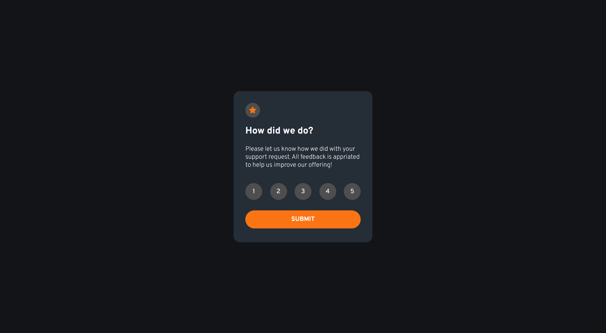

# interactive-rating-component
Interactive rating component with React JS. This exercise is part of the Make It Real bootcamp.

## Table of contents

- [Overview](#overview)
  - [The challenge](#the-challenge)
  - [Screenshot](#screenshot)
- [My process](#my-process)
  - [Built with](#built-with)
  - [What I learned](#what-i-learned)
  - [Useful resources](#useful-resources)
- [Author](#author)


## Overview

The challenge is to build a rating component and try to make it as similar as possible with the design.

### The challenge

Use the next image as reference and build a rating component.


### Screenshot

That was the result.  




## My process

### Built with

- React JS
- SASS
- Flexbox
- Mobile-first workflow
- Pixel perfect tool = Pixel parallel

### What I learned

I learned how to manage the state in React JS.

```javascript
  const rageRate = [1, 2, 3, 4, 5];

  const [rate, setRate] = useState(0);
  const [hover, setHover] = useState(0)
  const [show, setShow] = useState(false);

  const handleClick = (event) => {
    const rateUpdated = event.target.getAttribute('data-rate-id');
    setRate(rateUpdated);
  }

  const handleMouseOver = (event) => {
    const numberUpdated = event.target.getAttribute('data-rate-id');
    setHover(numberUpdated);
  }

  const handleMouseOut = () => {
    console.log('Mouse over');
    setHover(0);
  }

  const handleClickModal = () => {
    setShow(false);
    setRate(0);
  }
```

### Useful resources

- [How to create a Modal Component in React from basic to advanced?](https://medium.com/tinyso/how-to-create-a-modal-component-in-react-from-basic-to-advanced-a3357a2a716a) - This guide helped me to create a modal card. It was pretty clair and descriptive.

## Author

- Website - [Juan Felipe](https://www.gomezjuanefe.com)